# ✂️ EfficientNet: Rethinking Model Scaling for Convolutional Neural Networks

<!-- TOC start (generated with https://github.com/derlin/bitdowntoc) -->
## 목차
0. [Abstract](#abstract)
1. [Introduction](#1-introduction)
2. [Related Works](#2-related-works)
   * [ConvNet Accuracy](#convnet-accuracy)
   * [ConvNet Efficiency](#convnet-efficiency)
   * [Model Scaling](#model-scaling)
3. [Compound Model Scaling](#3-compound-model-scaling)
   * 3.1. [Problem Formulation](#31-problem-formulation)
   * 3.2. [Scaling Dimensions](#32-scaling-dimensions)
   * 3.3. [Coumpound Scaling](#33-coumpound-scaling)
4. [EfficientNet Architecture](#4-efficientnet-architecture)
5. [Experiments](#5-experiments)
   * 5.1. [Scaling Up MobileNets and ResNets](#51-scaling-up-mobilenets-and-resnets)
   * 5.2. [ImageNet Results for EfficientNet](#52-imagenet-results-for-efficientnet)
   * 5.3. [Transfer Learning Results for EfficientNet](#53-transfer-learning-results-for-efficientnet)
6. [Discussion](#6-discussion)
 [References](#references)

<!-- TOC end -->

<!-- TOC -->
## 0. Abstract

- 기존의 연구에서는 depth, width, resolution 중 각 하나의 요소를 스케일링 하는 방식으로 모델의 성능을 향상시키려는 시도를 해왔다.
- 해당 논문에서는 간단하지만 효과적인 compound 계수를 사용하여 depth/width(channel)/resolution 이 세 가지 차원을 모두 uniformly하게 스케일링하는 method를 제안한다.
    - 이러한 방식의 스케일링 method를 MobileNet과 ResNet에 적용하였다.

<!-- TOC -->
## 1. Introduction

  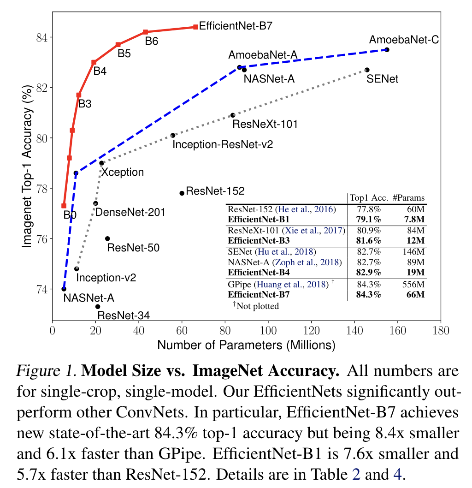

- 이전 연구에서는 depth, width, image size(resolution) 세 가지 차원 중 오직 하나만 스케일 하는 것이 일반적이었다.
- 두 세개의 차원을 arbitrarily(절삭)하게 스케일 하는 것은 가능하지만, 이러한 스케일링 method는 오래 걸리는 메뉴얼 튜닝을 요구하고, 흔하게 sub-optimal(차선의) accuracy와 efficiency를 야기한다.

> 💡 더 나은 accuracy와 efficiency를 얻을 수 있는 ConvNets을 스케일링 하는 원론적인 method가 있을까?
>   &emsp; 이에 저자는 간단하지만 효과적인 compound scaling method를 제안

  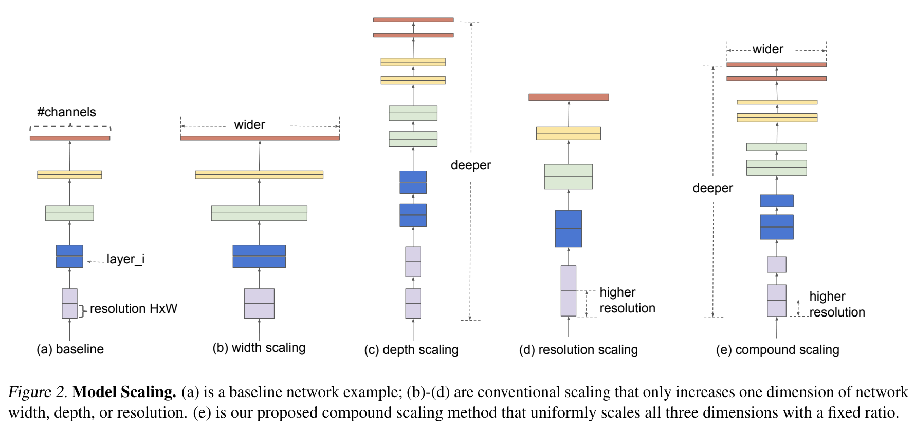

기존의 스케일링 방식 (a), (b), (c), (d), 저자가 제안한 compound scaling (e)

- 이러한 요소들을 절삭하여 스케일하는 기존의 관례적인 방법과 다르게 저자의 method는 고정된 스케일링 coefficients의 세트와 함께 네트워크의 width, depth, resolution을 uniformly하게 스케일한다.
- 예를 들어 $2^N$배 만큼 더 연산 자원을 사용하고 싶다면
    - 네트워크의 깊이는 $\alpha^N$, width는 $\beta^N$, 이미지의 사이즈(resolution)는 $\gamma^N$로 간단하게 늘리면 된다.
    - $\alpha, \beta, \gamma$는 원본의 작은 모델에서 small grid search로 결정된 상수 계수이다.

<!-- TOC -->
## 2. Related Works

<!-- TOC -->
### ConvNet Accuracy

- 모델들의 사이즈가 커짐에 따라accuracy가 더욱 높아졌다.
    - [GPipe](https://arxiv.org/pdf/1811.06965.pdf) (Huang et al., 2018)는 ImageNet top-1 validation accuracy가 84.3%인데 557M개의 파라미터를 사용
    - 많은 애플리케이션에서 더 높은 accuracy가 중요
    - 그러나 이미 하드웨어의 메모리 한계를 도달했기 때문에 더 높은 accuracy를 얻기 위해서는 더 나은 효율성이 필요

<!-- TOC -->
### ConvNet Efficiency

- 깊은 ConvNet은 자주 over-parameterized 된다.
- model compression(모델 압축)은 efficiency를 위해 accuracy를 trade함으로써 모델의 사이즈를 줄이는 일반적인 방법이다.
    - handcraft efficient mobile-size ConvNets
        - [SqueezeNets](https://arxiv.org/pdf/1602.07360.pdf)(Iandola et al., 2016; Gholami et al., 2018), [MobileNets](https://arxiv.org/pdf/1704.04861.pdf)(Howard et al., 2017; Sandler et al., 2018), [ShuffleNets](https://arxiv.org/pdf/1807.11164.pdf)(Zhang et al., 2018; Ma et al., 2018)
- 이 당시의 [neural architecture search](https://arxiv.org/pdf/1807.11626.pdf)는 네트워크 폭, 깊이, 컨볼루션 커널 유형 및 크기를 광범위하게 조정하여 handcraft mobile ConvNets보다 훨씬 더 나은 효율성을 달성했다.
    - 그러나 훨씬 더 큰 design space와 훨씬 더 비싼 튜닝 비용을 가지는 더 커다란 모델에 neural architecture search를 적용하는 방법은 불분명
    - 저자는 SOTA의 accuracy를 능가할 super large ConvNet의 모델 효율성을 연구하는 것을 목표로 함

<!-- TOC -->
### Model Scaling

- 다른 resource 제약에서 ConvNet을 스케일 하는 많은 방법이 존재한다.
    - layer depth: [ResNet](https://arxiv.org/pdf/1512.03385.pdf)
    - width(channel): [WideResNet](https://arxiv.org/pdf/1605.07146.pdf), [MobileNets](https://arxiv.org/pdf/1704.04861.pdf)
    - 입력 이미지의 사이즈를 늘리는 것도 잘 알려진 방법
- 선행 연구에서 네트워크 depth와 width이 ConvNet의 표현력에 모두 중요하다는 것을 보여주었다.
- 그러나 더 나은 efficiency와 accuracy를 달성하기 위해 ConvNet을 효과적으로 확장하는 방법은 여전히 미해결 문제로 남아 있었다.
    - 논문은 네트워크 depth와 width, resolution의 세 가지 차원 모두에 대해 ConvNet 확장을 체계적이고 경험적으로 연구

<!-- TOC -->
## 3. Compound Model Scaling

<!-- TOC -->
### 3.1. Problem Formulation

- ConvNet 레이어 $i$는 다음과 같은 함수로 정의 될 수 있다.

$$
Y_i = F_i(X_i)
$$

- $F_i$는 연산자, $Y_i$는 출력 텐서, $X_i$는 입력 텐서
- batch 차원을 제외한 텐서의 shape $\big <H_i, W_i, C_i \big>$
    - $H_i$과 $W_i$는 spatial 차원이고 $C_i$는 channel 차원
- ConvNet의 N은 구성된 레이어들의 리스트에 의해 표현될 수 있다.

  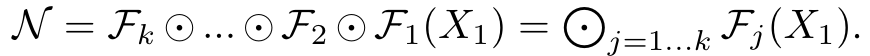

- ConvNet의 레이어들은 자주 다수의 stage 그리고 같은 architecture를 공유하는 각 stage의 모든 레이어들로 나눠진다.
- 따라서 ConvNet을 아래와 같이 정의할 수 있다.
    

  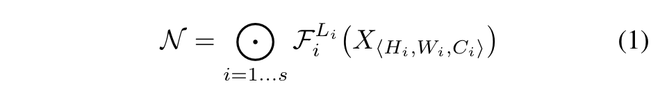

    
    - $F_i^{L_i}$는 stage $i$에서 $L_i$번 반복되는 레이어 $F_i$를 의미한다.
    - $\big <H_i, W_i, C_i \big>$는 레이어 $i$의 입력 텐서 $X$의 shape를 의미한다.
- baseline 네트워크에서 사전 정의된 $F_i$를 바꾸지 않고, 네트워크의 길이($L_i)$, width($C_i),$  resolution($H_i, W_i)$을 확장하여 모델을 스케일링한다.
    - 디자인 공간을 더 줄이기 위해서 모든 레이어는 반드시 constant ratio로 uniformly하게 스케일 되어야 함을 제한했다.
    - $\hat F_i, \hat L_i, \hat H_i, \hat C_i$는 baseline 네트워크에서 사전 정의된 파라미터
        

  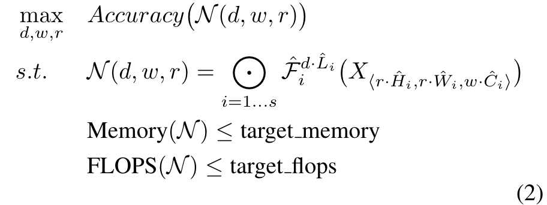

        
        

  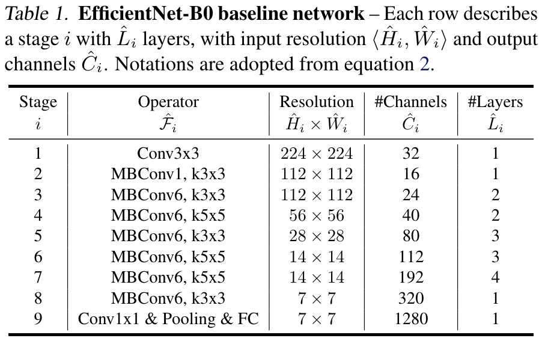

<!-- TOC -->
### 3.2. Scaling Dimensions

- problem 2의 주된 어려움은 최적의 $d, w, r$이 서로 의존을 하고, 다른 자원 제약 조건 하에 값이 변하는 것이다.
- 이러한 어려움으로 기존의 method의 대부분은 차원들($d, w, r$) 중 하나에서만 확장한다.

        

  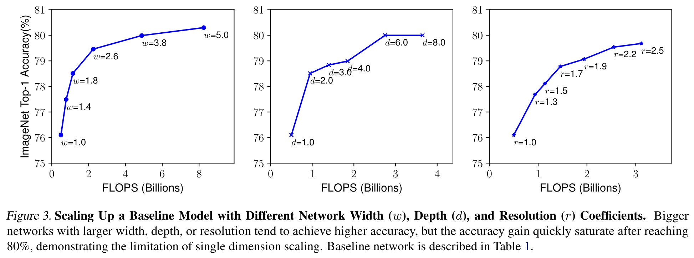

  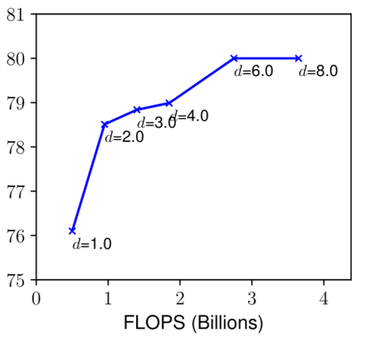

**Depth ($d$)**

- 네크워크의 depth를 스케일링 하는 것은 많은 ConvNet에 사용되는 가장 일반적인 방법이다.
- 직관적으로 더 깊은 ConvNet이 풍부하고 더 복잡한 feature를 포착할 수 있고 새로운 task에 일반화되기 쉽다.
- 그러나 깊은 네트워크는 vanishing gradient 문제로 학습하기가 더 어렵다.
    - skip connections과 batch normalization 같은 몇몇의 테크닉들이 훈련에서의 문제를 완화하였다.

  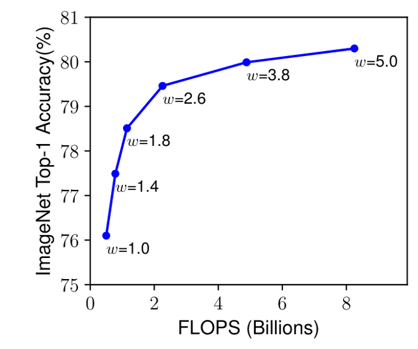

**Width($w$)**

- 네트워크의 width를 스케일링 하는 것은 주고 작은 크기의 모델에서 사용되었다.
- 넓은 네트워크는 더 fine-grained한 feature를 포착하는 경향이 있고, 훈련 시키기 쉽다.
    - 그러나 극도로 wide하지만 얕은 네트워크는 고차원의 feature를 포착하는데에서 어려움을 가지는 경향이 있다.
    - Figure 3에서 네트워크가 큰 $w$로 더 넓어질 때 accuracy가 급격하게 saturate 되는 것을 볼 수 있다.

  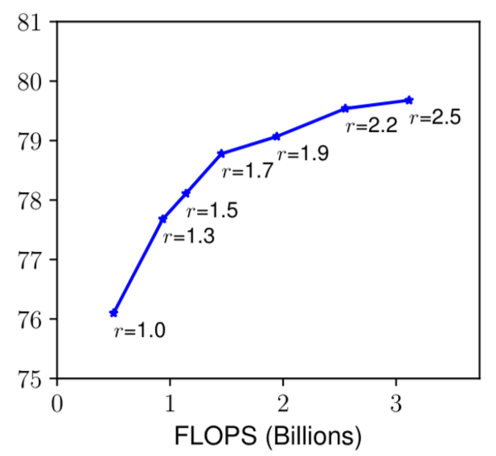

**Resolution ($r$)**

- 고화질의 입력 이미지가 주어졌을 때 ConvNet은 더 fine-grained한 패턴을 잠재적으로 포착할 수 있다.
- Figure 3은 네트워크의 resolution 스케일리의 결과를 보여주는데 당연하게도 높은 화질일수록 accuracy가 향상되었다.
    - 그러나 accuracy는 매우 높은 resolution에서 향상이 감소하였다.
    - $r=1.0$은 224x224 화소를 의미하고, $r=2.5$는 560x560 화소를 의미한다.

> 💡 관찰 1 -  네트워크의 width, depth, resolution 어느 하나의 차원을 scaling up 하는 것은 accuracy를 향상시킨다. 그러나 accuracy의 향상은 큰 모델에 있어서 줄어들게 된다.

<!-- TOC -->
### 3.3. Coumpound Scaling

  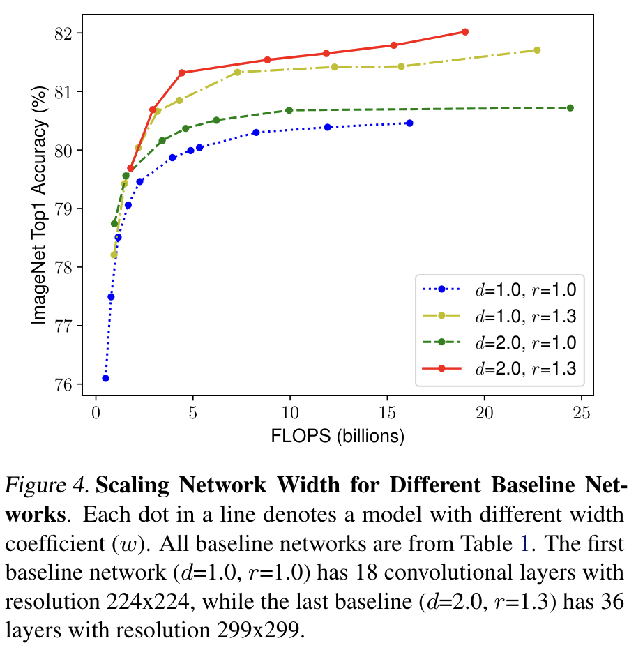

- 저자는 경험적으로 다른 차원들을 스케일링 하는 것은 독립적이지 않다는 것을 발견했다.
    - 고화질의 이미지에 있어서 네크워크의 depth를 늘려야만한다.
    - 큰 receptive field가 더 큰 이미지에서 더 많은 픽셀을 포함하는 유사한 feature들을 포착할 수 있기 때문이다.

> 💡 관찰 2 - 더 나은 acccuracy와 efficiency를 얻기 위해서는 ConvNet 스케일링을 하면서 네트워크의 width, depth, resolution의 모든 차원을 균형잡는 것은 매우 중요하다.

  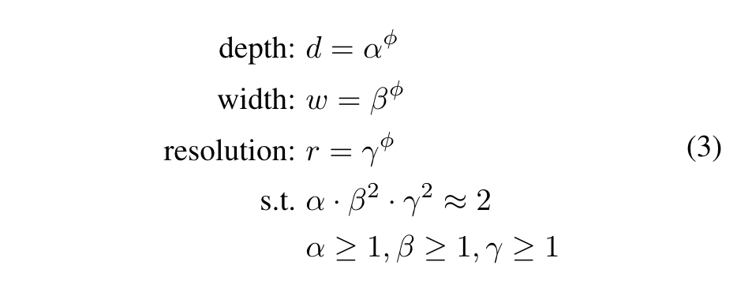

- $\alpha, \beta, \gamma$는 small grid search에 의해 결정될 수 있는 상수.
- 직관적으로 φ는 모델을 스케일링 하는데에 얼만큼의 리소스를 더 사용할 수 있는지를 조절하는 user-specified 계수이다.
- 반면 $\alpha, \beta, \gamma$는 어떻게 추가적인 리소스를 네트워크의 width, depth, resolution에 assign할 수 있을지에 달려 있다.

> 💡 Conv Layer에서의 FLOPs 계산 방법은? 
>   &emsp; FLOPs = 2 × 커널 Width × 커널 Height × 입력 채널 × 출력 채널 × 출력 Width × 출력 Height

- 일반적인 convolution 계산의 FLOPS는 $d, w^2, r^2$에 비례한다.
    - 네트워크의 depth를 두 배로 만드는 것은 FLOPS를 두 배로 만든다.
    - 그러나 네트워크의 width나 resolution을 두 배로 만드는 것은 FLOPS를 4배 증가시킨다.
- ConvNets에서 convolution 연산이 일반적으로 연산량의 대부분을 차지하기 때문에, 식3으로 ConvNet을 스케일링 하는 것은 대략 전체 FLOPS를 $\big(\alpha\cdot\beta^2\cdot\gamma^2)^\phi$로 증가시킬 것이다.
    - 해당 논문에서는 $\alpha\cdot\beta^2\cdot\gamma^2\approx2$로 제약하여 어떤 새로운 $\phi$에서도 전체 FLOPS가 대략적으로 $2^\phi$로  증가하도록 했다.

<!-- TOC -->
## 4. EfficientNet Architecture

  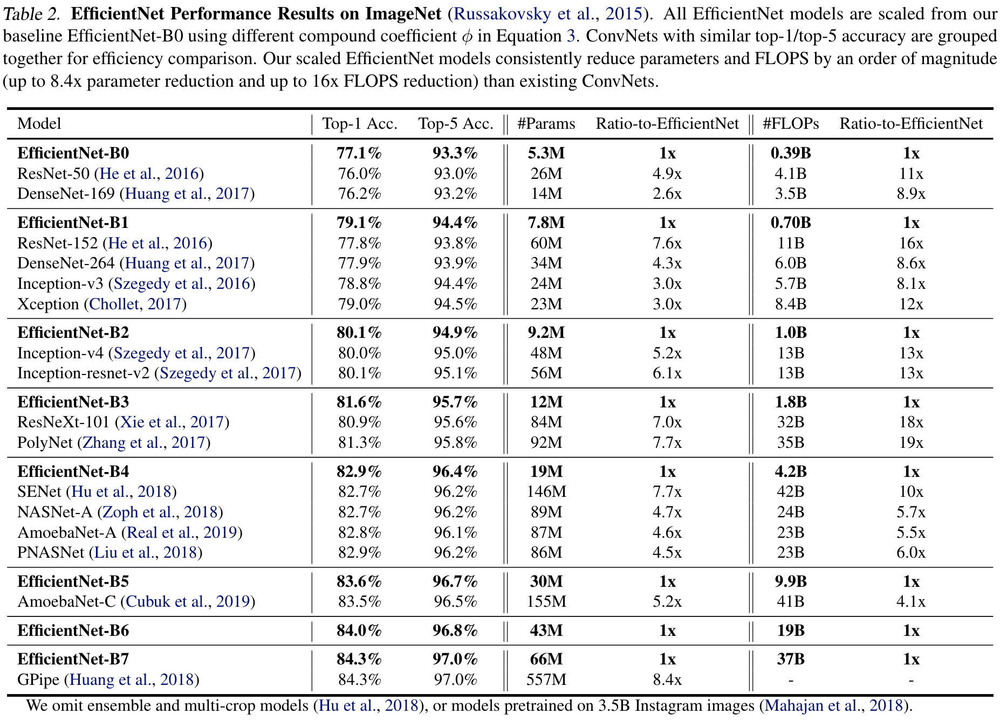

- baseline인 EfficientNet-B0부터 시작해서 아래의 두 단계로 compound scaling method를 적용하여 스케일을 늘림.
    
    STEP 1
    
    - resource를 두 배 더 사용할 수 있다고 가정하고, $\phi=1$로 고정하고 식 2, 3을 기초로 하여 $\alpha, \beta, \gamma$의 small grid search를 실행
    - $\alpha \cdot\beta^2\cdot\gamma^2\approx2$의 제한하에 Efficient-B0의 최적의 값으로는 $\alpha = 1.2, \beta=1.1, \gamma=1.15$를 찾음
    
    STEP 2
    
    - 이후 EfficientNet-B1 ~ B7을 얻기 위해 $\alpha, \beta, \gamma$를 상수로 고정
    - 식3을 사용하여 다른 $\phi$를 이용하여 baseline network를 scale up

<!-- TOC -->
## 5. Experiments

<!-- TOC -->
### 5.1. Scaling Up MobileNets and ResNets

  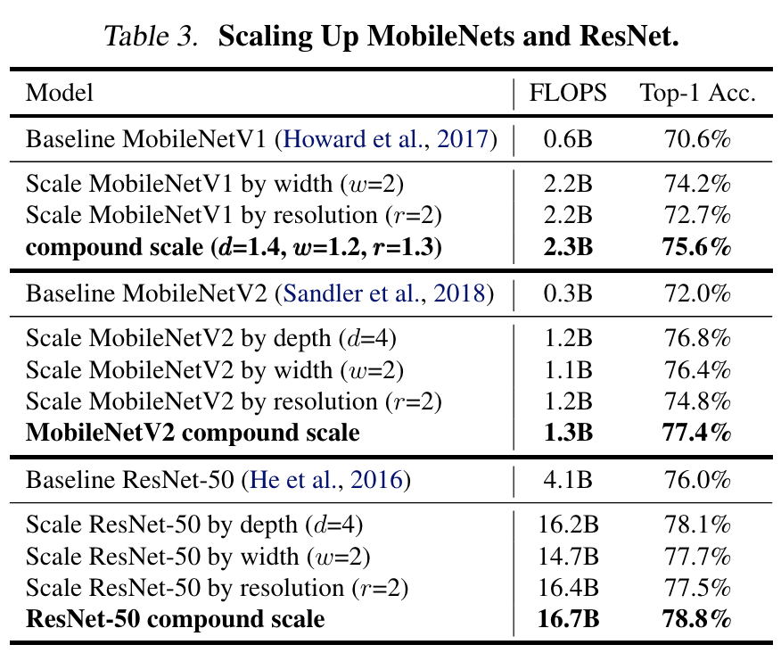

- 위 개념을 증명하기 위해 널리 사용되는 모델인 MobileNets과 ResNet에 scaling method를 적용함.
    - 다른 single-dimension scaling methods와 비교했을 때 저자의 compound scaling method가 모든 모델에 있어서 accuracy를 향상시켰다.

<!-- TOC -->
### 5.2. ImageNet Results for EfficientNet

  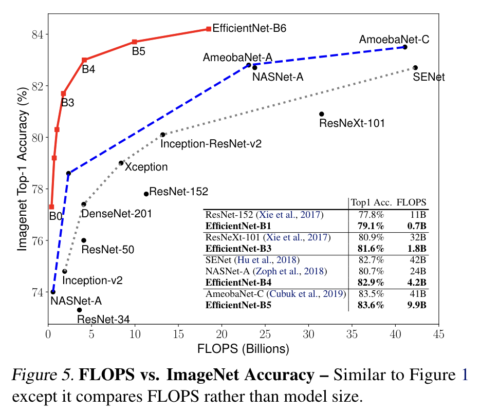

- EfficientNet 모델은 일반적으로 비슷한 accuracy를 가진 다른 ConvNets보다 더 적은 파라미터와 FLOPS를 사용한다.
    - EfficientNet이 크기가 작을 뿐만 아니라 연산량도 적었다.
    - EfficientNet-B3가 18배 적은 FLOPS를 사용하면서도 ResNeXt-101보다 더 높은 accuracy를 달성했다.

  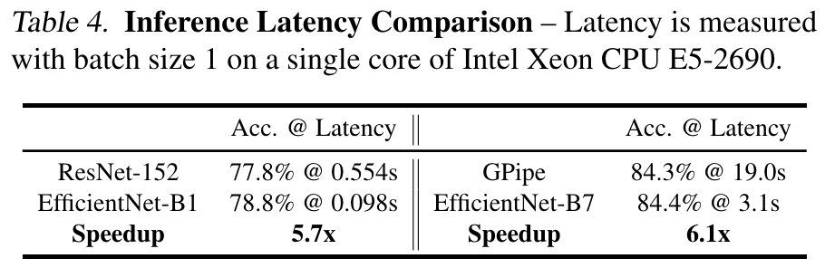

- 또한 Latency를 검증하기 위해서 몇 개의 대표적인 ConvNet을 실제 CPU에서 Inference latency를 측정했다.
    - Latency 측정 방식은 20번 돌려서 평균을 구함.

<!-- TOC -->
### 5.3. Transfer Learning Results for EfficientNet

  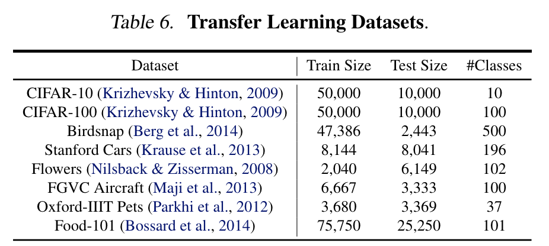

- 위의 데이터셋을 사용하여 EfficientNet의 Transfer Learning 퍼포먼스를 평가해보았다.

  

- EfficientNet이 기존의 모델(ResNet, DenseNet, NASNet)보다 더 적은 파라미터를 가지면서도 일관적으로 더 나은 accuracy를 얻었다.

<!-- TOC -->
## 6. Discussion

  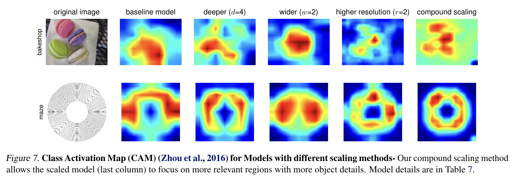

- compound scaling method가 왜 다른 방법들보다 나은지를 더욱 이해하기 위해 다른 스케일링 방법을 사용한 모델들과CAM(class activation map)을 비교하였다.

> 💡 CAM이란? CNN이 특정 클래스를 식별할 때 어떤 지역을 중요하게 생각하는지를 시각화한 기법. ([Learning Deep Features for Discriminative Localization](https://openaccess.thecvf.com/content_cvpr_2016/papers/Zhou_Learning_Deep_Features_CVPR_2016_paper.pdf))

<!-- TOC -->
## References

- [tpu/models/official/efficientnet at master · tensorflow/tpu](https://github.com/tensorflow/tpu/tree/master/models/official/efficientnet)

- https://github.com/lukemelas/EfficientNet-PyTorch
-  [EfficientNet.pdf](https://prod-files-secure.s3.us-west-2.amazonaws.com/bc19f819-d81c-42d6-aaad-75bac095757a/5dc209d2-2857-45fe-98ec-df074fb3d859/EfficientNet.pdf)
