# ✴️ Point-Query Quadtree for Crowd Counting, Localization, and More
- [✴️ Point-Query Quadtree for Crowd Counting, Localization, and More](#️point-query-quadtree-for-crowd-counting-localization-and-more)
    - [군중 계수(Crowd Counting)란?](#군중-계수crowd-counting란)
- [Abstract](#abstract)
- [1. Introduction](#1-introduction)
- [2. Related Work](#2-related-work)
  - [Counting by Density Map](#counting-by-density-map)
  - [Counting by Localization](#counting-by-localization)
  - [Transformer Based Counting](#transformer-based-counting)
- [3. Counting Crowd by Querying Points](#3-counting-crowd-by-querying-points)
  - [3.1. Problem Formulation](#31-problem-formulation)
  - [3.2. Architecture Overview](#32-architecture-overview)
  - [3.3. Point-Query Quadtree](#33-point-query-quadtree)
    - [Quadtree Construction](#quadtree-construction)
    - [Point Query Representation](#point-query-representation)
    - [Crowd Prediction](#crowd-prediction)
  - [3.4. Progressive Querying in Rectangle Window](#34-progressive-querying-in-rectangle-window)
    - [Progressive Encoder Attention](#progressive-encoder-attention)
    - [Decoding Within Rectangle Window](#decoding-within-rectangle-window)
  - [3.5. Network Optimization](#35-network-optimization)
    - [Traninng](#traninng)
    - [Inference](#inference)
  - [\[추가 작성 예정\]](#추가-작성-예정)
  - [References](#references)

### 군중 계수(Crowd Counting)란?
---

군중 계수는 이미지에서 사람을 세는 task이다. 주로 감시 및 교통 통제와 같은 자동화된 공공 모니터링에 실생활에서 사용된다. 군중 계수는 객체 감지(Object Detection)와는 달리 인적이 드문 곳이나 복잡한 장면 등 다양한 상황에서 임의의 크기의 대상을 동시에 인식하는 것을 목표로 한다.

# Abstract

- 저자는 군중 계수(crowd counting)를 분해 가능한(decomposable) 포인트 쿼리 프로세스(point querying process)로 볼 수 있음을 보여준다.
    - 이 point querying process는 임의의 포인트를 입력으로 사용할 수 있으며, 해당 포인트가 군중인지 여부와 위치를 공동으로 추론할 수 있다.
- 그러나 querying processing에는 필요한 쿼리 포인트의 수에 대한 근본적인 문제가 발생한다.
    - 포인트의 수가 너무 적으면 과소평가가 발생하고 너무 많으면 계산 오버헤드가 증가한다.

<aside>
💡 이 딜레마를 해결하기 위해 decomposable structure, 즉 포인트 쿼리 쿼드트리를 도입하고, Point quEry Transformer(PET)라는 새로운 카운팅 모델을 제안!

</aside>

- PET는 data-dependent quadtree splitting을 통해 분해 가능한 포인트 쿼리를 구현하며, 각 쿼리 포인트는 필요에 따라 4개의 새로운 포인트로 분할될 수 있으므로 희소하고 밀집된 영역을 동적으로 처리할 수 있다.
- 이러한 쿼리 프로세스는 입력과 출력을 모두 해석하고 조정할 수 있기 때문에 직관적이고 보편적인 군중 모델링을 생성한다.

# 1. Introduction

  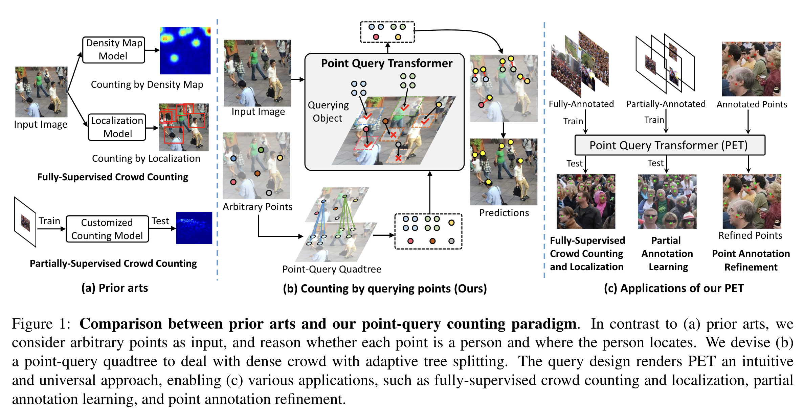

- 포인트 쿼리 설계를 통해 모델은 임의의 포인트를 입력으로 받아 각 포인트가 사람인지 여부와 위치를 추론할 수 있다.
- 포인트 쿼리 특성은 직관적이고 보편적인 군중 모델링을 제공한다.
    - 각 querying point가 물리적으로 사람이나 배경에 대응한다는 점에서 직관적이며
    - querying point의 임의성은 입력 포인트의 위치와 개수를 모두 조정할 수 있다는 것을 의미
- 입력 이미지에는 임의의 수의 군중이 포함될 수 있으므로 querying point의 수를 미리 정의하는 것은 간단하지 않다.
    - 포인트가 너무 적으면 과소평가가 발생하고, 포인트가 너무 많으면 계산 비용이 많이 들기 때문

  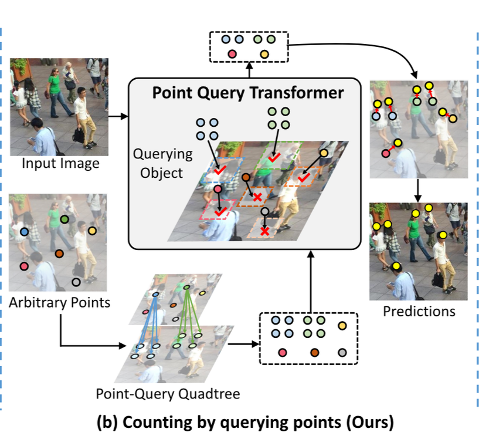

- 저자는 이러한 문제를 해결하기 위해 분해 가능한 구조인 point-query quadtree를 제안한다.
- quadtree의 주요 장점은 데이터에 따라 하나의 querying point를 필요에 따라 여러 개의 새로운 포인트로 분할할 수 있어 sparse하고 dense한 영역을 동적으로 처리할 수 있다.
- quadtree를 기반으로 분해 가능한 포인트 쿼리를 달성하기 위해 Point quEry TRansformer(PET)를 인스턴스화한다.
- PET의 또 다른 핵심 요소는 효율적인 추론을 위해 전체 이미지가 아닌 local window 내에서 쿼리 프로세스를 점진적으로 수행하는 progressive rectangle window attention이다.

# 2. Related Work

  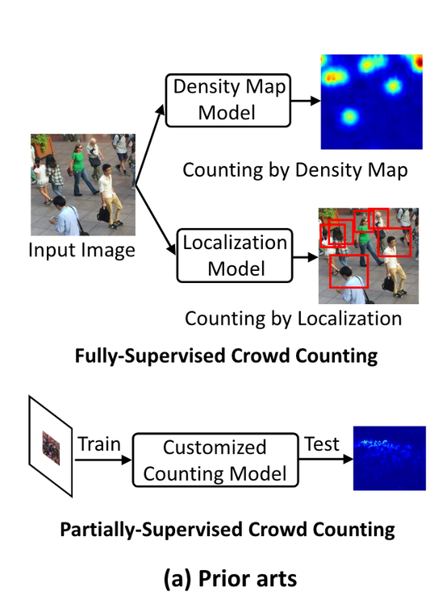

## Counting by Density Map

- 밀도 맵을 대리 학습 대상으로 사용하며, 예측된 밀도 맵을 통합하여 카운트 값을 계산한다.
- 밀도 맵과 카운트 값 사이의 불일치를 완화하기 위해 패치의 카운트 값을 이산 구간으로 분류하여 로컬 카운팅 패러다임을 채택하는 또 다른 작업도 있다.
- 성공적이기는 하지만, 밀도 맵 기반 접근 방식은 일반적으로 인스턴스 수준 예측을 제공하지 않는다.
- 반면, 저자의 접근 방식은 각 사람의 위치를 점으로 출력할 수 있어 군중을 보다 직관적으로 이해할 수 있다.

## Counting by Localization

- 군중의 수와 위치를 동시에 추정하는 또 다른 대안이다.
    - 예를 들어, 최근의 일부 접근법은 인원수를 head detection 문제로 간주하여 머리의 바운딩 박스를 예측한다.
    - 그러나 weak point supervision에서 생성된  pseudo ground-truth box는 특히 혼잡한 지역에서 오류가 발생하기 쉽다. 결과적으로 모델 학습을 방해할 뿐만 아니라 부정확한 박스 예측으로 이어진다.
- 바운딩 박스 외에도 여러 접근법이 헤드 포인트를 직접 추정한다.
    - 그러나 이러한 접근 방식은 개별 군중을 식별하기 위해 heuristic 후처리가 필요한 경우가 많다.
- 앞선 접근 방식과 달리 저자의 방식은 임의의 점을 입력으로 받아 점과 주변 환경 사이의 관계를 명시적으로 모델링하여 군중을 예측한다.

## Transformer Based Counting

- 트랜스포머의 강한 표현 능력으로 인해 기존 접근 방식은 주로 특징 추출을 위한 강력한 트랜스포머 백본을 개발하고 이를 예측 모듈과 통합하여 카운트 값을 추정하는 데 중점을 두었다.
- 이와 대조적으로, 저자는 군중 계수를 위한 새로운 공식을 제시하고 이를 맞춤형 Point quEry TRansformer(PET)로 인스턴스화한다.

 

# 3. Counting Crowd by Querying Points

## 3.1. Problem Formulation

PET의 필수적인 두 가지 요소 : 

i) point-query quadtree의 설계

ii) progressive rectangle window atention 메커니즘

전자는 밀집된 군중 예측을 처리하기 위해 쿼리 포인트를 적응적으로 생성하고, 후자는 효율성을 향상시킨다.

## 3.2. Architecture Overview

  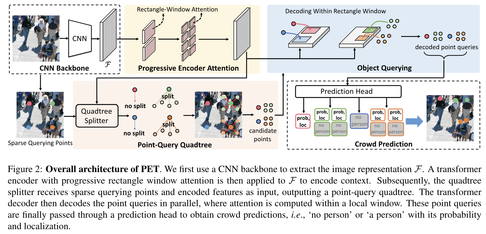

PET를 구성하는 네 가지 요소: CNN backbone, encoder-decoder transformer, point-query quadtree, prediction head

1. 입력 이미지가 주어지면 CNN 백본은 우선 이미지 representation을 추출하여 특징 맵 $F$를 출력한다.
    - 특징 맵 $F$의 각 공간적 요소는 토큰이며 $h\times w$개의 토큰이 생성된다.

$$
F \in \R^{h\times w\times c}
$$

1. 이 토큰은 progressive rectangle window attention을 적용한 트랜스포머 인코더를 통해 context로 인코딩
2. Quadtree Splitter는 sparse querying points와 인코딩된 feature를 입력으로 받아, point-query quadtree를 출력
3. 트랜스포머 디코더는 point-query quadtre와 인코딩된 feature를 입력으로 받아 이미지 context에 따라서 포인트 쿼리 간의 관계를 추론하고, 포를인 퀄를리  병렬 딩디코딩
4. prediction head는 디코딩된 포인트 쿼리를 통해 ‘사람 없음’ 또는 ‘사람 있음’의 확률과 만약 사람이 있다면 그 위치를 예측

## 3.3. Point-Query Quadtree

- 입력 이미지에 임의의 수의 군중이 포함될 수 있다는 점을 고려할 때 object detection에서처럼 고정된 수의 쿼리를 사용하는 것은 비합리적

<aside>
💡 확장 가능한 군중 추정을 가능하게 하려면 포인트 쿼리가 의미 있고 유연해야 한다!

</aside>

- 이로인해 발생하는 세 가지 문제점
    1. 쿼리 포인트의 수를 다양한 장면에 맞게 조정하는 방법
    2. 포인트 쿼리를 표현하는 방법
    3. 포인트 쿼리를 통해 군중을 예측하는 방법

### Quadtree Construction
---

  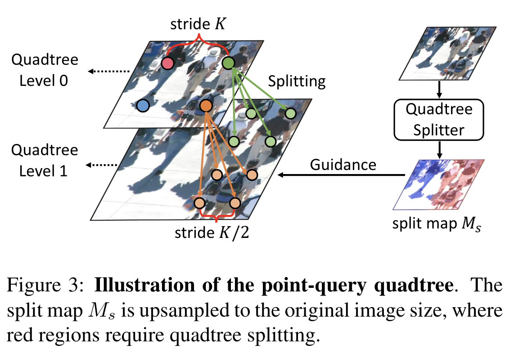

- 저자는 포인트 쿼리를 sparse하고 dense한 장면으로 확장할 수 있도록 분해 가능한 구조인 point-query quadtree를 제안
- sparse 쿼리 포인트를 분할할 시점을 결정하기 위한 기준이 필요, 분할 프로세스는 단일 지점에 의존하는 대신 로컬 지역을 통해 결정해야 한다.
    - 따라서 quadtree를 구성하기 위해 region-based quadtree splitter를 채택

  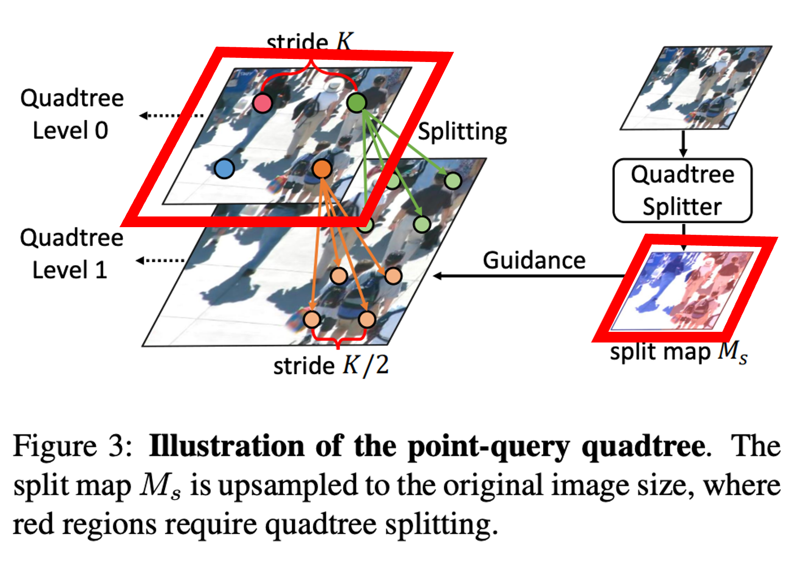

**Quadtree Level 0**: K의 stride으로 이미지에 sparse 쿼리 포인트를 균일하게 설정.

**Quadtree Splitter:** 인코딩된 feature를 입력받아 분할 맵 $M_s \in \R^{h'\times w'}$ 출력

- $M_s$의 각 요소는 영역이 밀집되어 있을 확률을 나타낸다.
    - 1: dense 영역, 0: sparse 영역

  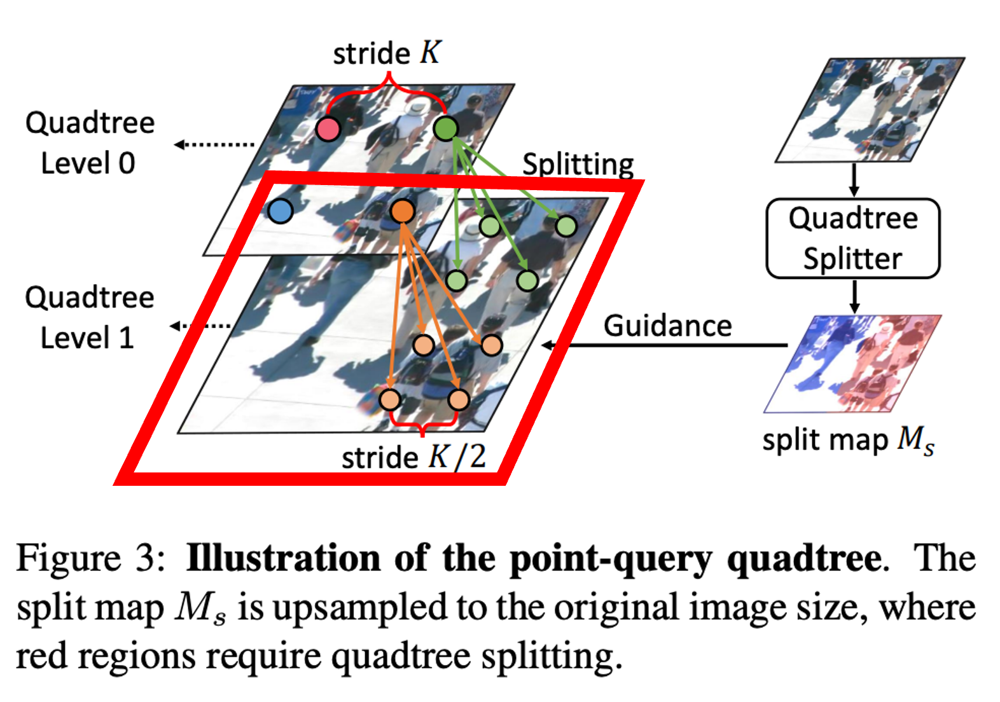

**Quadtree Level 1**: Dense 영역의 초기 쿼리 포인트는 밀집 쿼리 포인트로 분할되어 quadtree 레벨 1을 형성.

- 이 프로세스는 최대 분할 횟수인 L에 도달할 때까지 반복되며, 그 결과 $L+1$-layer quadtree가 생성.
- 다중 레이어 quadtree는 여러 개의 quadtree splitter를 사용하여 각 레이어의 split map을 예측함으로써 구현 가능.
    - 그러나 일반적으로 한 번의 분할(L=1)로 군중 예측을 처리하기에 충분하다는 것을 알아냄.

  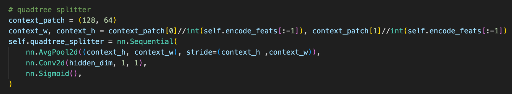

- 또한 Quadtree Splitter는 AvgPooling 레이어와 1×1 Conv 레이어, 시그모이드 함수로 구성되므로 계산 비용이 작다.

  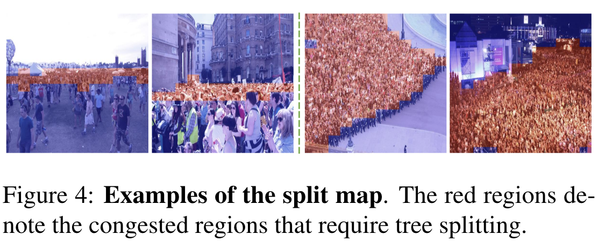

- 빨간색 영역은 quadtree 분할이 필요한 혼잡한 영역을 나타낸다. 분할 맵은 0.5의 threshold을 사용하여 이진 분할된다.

### Point Query Representation
---

- 픽셀 위치(x, y)와 함께 querying point(sparse 쿼리 포인트) 가 주어지면 이를 포인트 쿼리로 표현해야 한다.
- 포인트 쿼리에는 의미 정보와 위치 정보 모두 포함되어야 하는데 포인트 쿼리의 의미를 인코딩하기 위해 CNN 특징 맵을 다시 활용한다.
    - CNN 특징 맵 F를 원본 이미지 크기에 interpolate하고 특징 벡터 $F_{x, y} \in \R^{1\times 1\times c}$를 샘플링한다.
- 위치 정보의 경우, [DETR](https://arxiv.org/pdf/2005.12872)에 따라 고정 공간 positional embedding을 사용하며 positional embedding과 $F_{x, y}$를 sum하여 포인트 쿼리 representation을 형성

### Crowd Prediction
---

마지막 단계는 포인트 쿼리를 통해 군중을 예측하는 방법이다. 점 주석(사람당 점 하나)의 철학에 따라 각 사람을 고유한 포인트 쿼리로 표현한다. 

- 먼저 트랜스포머 디코더를 통해 포인트 쿼리 quadtree를 전달하여 디코딩된 표현을 얻는다.
- 그 다음 prediction head를 디코딩된 포인트 쿼리에 적용하여 예측된 사람 집합 $Q$을 출력한다.

$$
Q=\{q_i\}^N_{i=1}
$$

- 여기서 $q_i$는 classification 확률 $c_i\in [0,1]$과 정규화된 픽셀 위치 $p_i=(x_i+\Delta x_i, y_i +\Delta y_i)$로 구성된다.
    - $(x_i, y_i)$: 포인트 쿼리의 픽셀 위치
    - $(\Delta x, \Delta y)$: 예측된 오프셋
- prediction head는 ReLU와 MLP 레이어로 구성

저자는 포인트 쿼리 quadtree에 의해 쿼리가 즉석에서 생성되므로 예측 헤드는 다양한 이미지에 대해 다양한 수의 쿼리를 받는다는 점을 주목함. 이것은 sparse하고 dense한 포인트 쿼리가 해당 영역에서만 작동하여 불필요한 계산을 피하도록 한다.

## 3.4. Progressive Querying in Rectangle Window

### Progressive Encoder Attention

  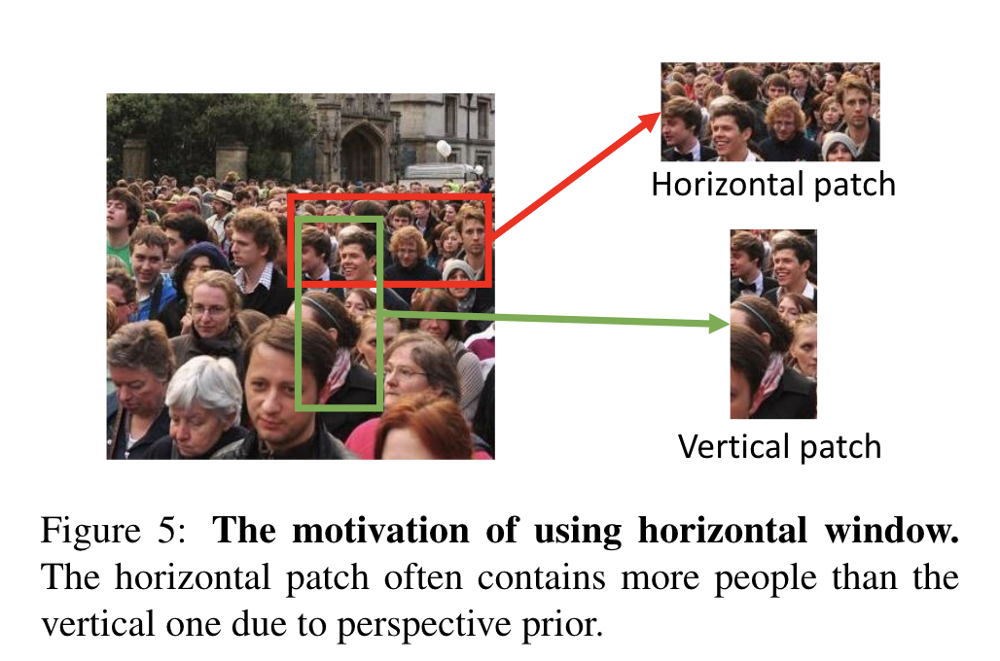

- 저자는 다양한 규모의 군중 정보를 인코딩하기 위해 progressive attention 메커니즘을 사용, 트랜스포머 인코더가 먼저 충분히 큰 영역을 검사한 다음 작은 영역에 초점을 맞추도록 한다.
- 군중 이미지에서 원근 변화가 자주 발생한다는 점을 고려하여 rectangle window 내에서 attention을 계산하며, 일반적으로 vertical window보다 horisontal window에 더 많은 사람이 포함되므로 horisontal window로 디자인 한다.

  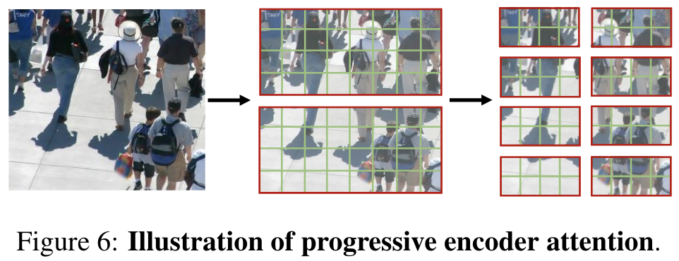

- 입력 이미지가 주어지면 먼저 처음 몇 개의 인코더 레이어에서 비교적 큰 rectangle window 내에서 attention을 수행
    - 각 윈도우의 크기: $s_e\times r_es_e$
    - $s_e$: 높이, $r_e$: 종횡비
- 이후 다음 인코더 레이어에서 작은 rectangle window($\frac{1}{2}s_e\times \frac{1}{2}r_es_e$)내에서 attention을 수행

  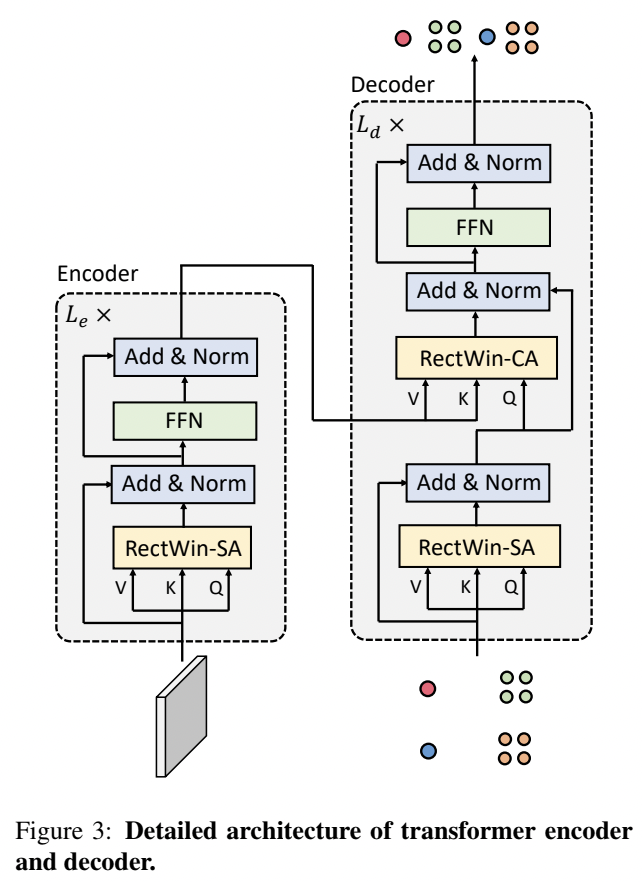

    
- 인코더 attention은 다음과 같이 계산
  

  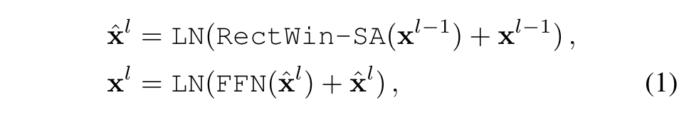

- 여기서 $x^{l-1}$과 $x^l$은 각각 인코더 레이어 $l-1$과 레이어 $l$의 출력 feature이다.
    - $x^0$은 특징 맵 $F$로 초기화된다.
    - $\texttt{RectWin-SA}$: rectangle window self-attention
    - $\texttt{FFN}$: feed-forward network
    - $\texttt{LN}$: layer normalization

  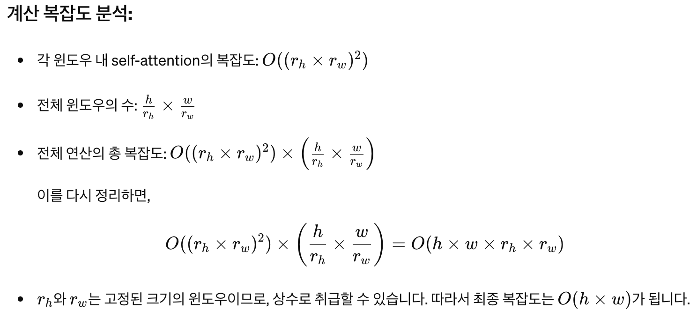

- progressive rectangle window attention 디자인의 이점으로 선형 복잡도로 효율적인 계산을 수행할 수 있으며, 고해상도 이미지를 처리할 때 유용하다.

### Decoding Within Rectangle Window
---

- 트랜스포머 디코더는 포인트 쿼리 quadtree와 인코딩된 이미지 feature를 입력으로 받아 디코딩된 포인트 쿼리를 출력한다.
- 이미지 context에 따라 포인트 쿼리 간의 관계를 모델링하여 군중을 추론한다.
- 저자는 **주변의 포인트 쿼리와 context를 기반**으로 포인트 쿼리가 사람인지 아닌지를 결정
    - 따라서 local window 내에서 디코더 attention 계산하는 것을 제안함.
    - 또한 quadtree의 계층 구조를 고려하여 포인트 쿼리를 디코딩할 때도 progressive attention을 채택.
- sparse 포인트 쿼리의 attention은 비교적 큰 rectangle window($\frac{1}{2}s_e\times \frac{1}{2}r_es_e$)내에서 attention을 계산한다.
- dense 포인트 쿼리의 window 크기는 $\frac{1}{4}s_e\times \frac{1}{4}r_es_e$로 줄인다.

  

- 디코더 attention은 다음과 같이 계산

  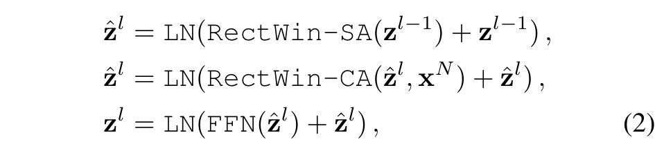

- $x^N$: 트랜스포머 인코더의 최종 ouput
- 여기서 $z^{l-1}$과 $z^l$은 각각 디코더 레이어 $l-1$과 레이어 $l$의 출력 feature이다.
    - $z^0$은 포인트 쿼리의 reperesentation으로 초기화된다.
    - $\texttt{RectWin-SA}$: rectangle window self-attention
    - $\texttt{RectWin-CA}$: rectangle window cross-attention
    - $\texttt{FFN}$: feed-forward network
    - $\texttt{LN}$: layer normalization

## 3.5. Network Optimization

### Traninng

- PET의 output은 candidate 사람의 집합 $Q=\{q_i\}^N_{i=1}$
- 저자는 prediction과 ground truth points 사이의 bipartite matching(이분 매칭) $Y=\{y_i\}^M_{i=1}$ 을 사용하여 네트워크를 최적화한다.
- loss는 다음과 같이 계산:
    

  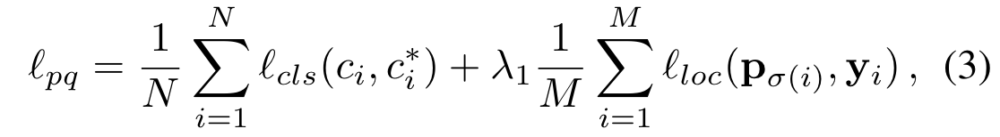

    
  - $i$: 포인트 쿼리의 인덱스
  - $c_i$: 예측된 classification 확률
  - $\lambda_1$: 하이퍼파라미터
  - $\sigma(i)$: ground-truth 포인트 $y_i$와 일치하는 포인트 쿼리의 인덱스
      - σ는 이분 매칭으로 얻는다.
  - $c_i^*$: classification label
      - 포인트 쿼리가 ground-truth 포인트와 일치하면 1, 그렇지 않은 경우 0
  - $l_{cls}$:  classification loss
      - cross entropy loss
  - $l_{loc}$:  localization loss
      - smooth $l_1$ loss

 

- 또한 quadtree splitter의 학습 과정은 다음과 같다.
    

  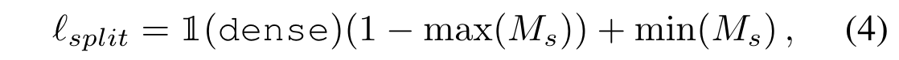

    
- $M_s$: split map
    - 입력 이미지에 dense 영역이 있으면 $\mathbb{1}(\texttt{dense})$는 1이, 그렇지 않으면 0
- 식 (4)는 quadtree splitter가 dense 영역과 sparse 영역을 구별하기 위한 minimum supervision 역할을 한다.
- 일반적으로 이미지에 sparse 영역이 존재하기 때문에 두 번째 항은 그대로 유지한다.

 

- 최종 손실 함수는 다음과 같다:
    

  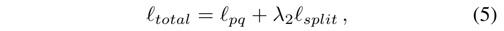

    
- $\lambda_2$: weight-balancing 하이퍼파라미터
        
    **Dual Supervision** 
        
    저자는 사람이 적은 샘플로 인해 loss가 희석되는 것을 방지하기 위해 dual supervision을 도입했다. 
        
    - 샘플의 미니 배치가 주어지면 군중 밀도에 따라 sparse pack과 dense pack으로 나누고 이 두 pack에 대해 $l_{total}$을 별도로 계산
    - 그 다음 backpropagation를 위해 손실을 sum

### Inference

- 테스트 중에 point-query quadtree는 분할 맵 $M_s$를 기반으로 동적으로 구성된다.
- 최종 prediction은 포인트 쿼리의 classification 확률 임계값(예: 임계값 0.5)을 설정하여 얻는다.

## [추가 작성 예정]
 

## References

- [Liu, Chengxin, et al. "Point-query quadtree for crowd counting, localization, and more." Proceedings of the IEEE/CVF International Conference on Computer Vision. 2023.](https://arxiv.org/pdf/2308.13814)
- https://github.com/cxliu0/PET